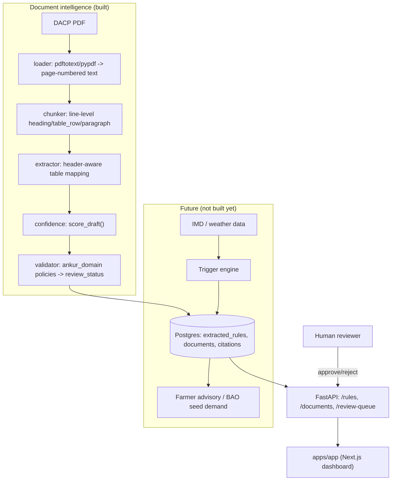

# Ankur

SIH 2026 (SIH26086), Ministry of Earth Sciences. Corpus: **India-wide** (646 ingested DACP
documents across 30 states/UTs). Flagship demo scope remains **Haryana → Sirsa** -- the only
district with hand-curated, page-verified seed rules (`make seed`).

## What Ankur is

Ankur retrieves **pre-approved government contingency actions** from ICAR-CRIDA District
Agriculture Contingency Plans (DACP) and activates the one matching the moisture/dry-spell
condition IMD's forecast implies.

```text
Weather / forecast data
        ↓
Moisture / dry-spell condition
        ↓
DACP trigger
        ↓
Exact government recommendation
        ↓
Farmer advisory / Block Agriculture Officer action
```

Every recommendation traces back to an extracted DACP rule with its document + page citation.

## What Ankur explicitly is NOT

- **Not a monsoon forecasting system.** IMD remains the source of truth for weather/onset
  forecasts; Ankur only consumes that signal.
- **Not a chatbot / generic RAG system.** Document intelligence here is structured information
  extraction against a known schema, not "chat with the PDF."
- **Not an advice generator.** Ankur never invents a crop variety, seed rate, action, or
  citation. If a value is missing from the source document, it stays `null`. If extraction is
  ambiguous, the rule is routed to human review and is never automatically advisory-eligible.

## Architecture



The document extractor never talks to the weather system directly, and the (future) trigger
engine will only ever look up already-approved rules -- it does not generate them.

## Repository structure

```text
ankur/
├── apps/
│   ├── api/                    FastAPI service (thin routes -> ankur_domain services)
│   └── app/                    Next.js dashboard (rule browser / review queue UI)
│
├── packages/
│   ├── schemas/                ankur_schemas: Pydantic models (DACPRule, Citation, enums)
│   ├── domain/                 ankur_domain: business invariants, repository ports, services
│   └── geo/                    ankur_geo: state/district identity, resolve_region(), season +
│                                 condition-threshold parameters (India-wide, corpus-derived)
│
├── services/
│   ├── document-intelligence/  PDF -> pages -> chunks -> rule drafts -> validated rules
│   └── trigger-engine/         weather -> moisture -> condition -> advisory (RuleStore reader)
│
├── data/
│   ├── raw/                    Source DACP PDFs (647 files, 30 states/UTs)
│   ├── processed/               `make ingest` output JSON, `<state_slug>/<district_slug>/*.json`
│   └── fixtures/                Hand-curated Sirsa fixture used by the test suite
│
├── db/migrations/              Raw SQL migrations (documents, extracted_rules, ...)
├── docs/
├── scripts/
├── tests/                      unit/ + integration/ pytest suite (workspace-wide)
├── docker-compose.yml          Local Postgres/PostGIS
├── .env.example
├── Makefile
└── pyproject.toml              uv workspace root
```

`apps/api`, `packages/schemas`, `packages/domain`, `packages/geo`,
`services/document-intelligence`, and `services/trigger-engine` are a single
[uv workspace](https://docs.astral.sh/uv/concepts/projects/workspaces/) -- one venv, one
lockfile, editable cross-package imports (`ankur_schemas`, `ankur_domain`, `ankur_geo`,
`document_intelligence`, `trigger_engine`). `apps/app` is a separate pnpm-managed Next.js
project.

## Domain model

The central object is `DACPRule` (see `packages/schemas/src/ankur_schemas/rule.py`). Every
field except `state`, `district`, and `condition` is nullable -- DACP documents are inconsistent in what
they specify, and a missing value must stay `null` rather than being guessed:

```json
{
  "fields": {
    "state": "Haryana",
    "district": "Sirsa",
    "crop": "Pearl millet",
    "condition": "Normal onset followed by 15-20 day dry spell after sowing",
    "crop_stage": "After sowing",
    "action": "Re-sow",
    "variety": "HHB-67 Improved",
    "seed_rate": null,
    "actor": "Block Agriculture Officer"
  },
  "citation": { "document": "HAR16-Sirsa-30-06-2011.pdf", "page": 37 },
  "confidence": 0.94,
  "review_status": "pending"
}
```

## Provenance / citations

Every `DACPRule` carries a `Citation` (document + page + source text) and extraction metadata
(`extractor_version`, `extracted_at`, `confidence`). Two invariants are enforced in
`ankur_domain.policies` (unit-tested in `tests/unit/test_citations.py` and
`tests/unit/test_confidence.py`), and again at the database level via a `CHECK` constraint on
`extracted_rules`:

- **No citation → no approved rule.** `can_approve()` and the `ReviewService.approve()` /
  `POST /rules/{id}/approve` endpoint refuse to approve a rule with a blank citation, regardless
  of who's asking or what confidence says.
- **Low confidence → no automated advisory eligibility.** Extraction never assigns
  `review_status = approved` itself -- only `pending` or `needs_review`
  (`initial_review_status()`), and a rule only becomes `is_advisory_eligible` once a human has
  approved it.

`GET /rules/{id}/citation` answers "why did Ankur produce this recommendation?" directly.

## Local setup

Requires: [uv](https://docs.astral.sh/uv/), Docker, `pnpm` (for `apps/app`), and system
`poppler-utils` (`pdftotext`) for reliable PDF text extraction -- some government PDFs embed
fonts that `pypdf` alone decodes incorrectly; the loader falls back to `pypdf` if `pdftotext`
isn't installed.

GNU `make` is optional. On Windows PowerShell, use `.\scripts\dev.ps1 <target>` instead
(same names: `docker-up`, `migrate`, `seed`, `dev`, `test`).

```bash
cp .env.example .env
uv sync            # installs the whole Python workspace into one .venv
```

### Running PostgreSQL

```bash
make docker-up       # starts Postgres/PostGIS, waits until healthy; db/migrations/*.sql auto-applied on first boot
make migrate          # (re-)apply db/migrations/*.sql -- idempotent, safe to run any time
make psql              # open an interactive psql shell
make logs SERVICE=db    # follow container logs (omit SERVICE for all)
make docker-down     # stop and remove the container (add -v manually to also drop the volume)
make docker-reset     # drop the volume and start fresh
```

If host port 5432 is already taken, set `POSTGRES_PORT` **and** the port in
`DATABASE_URL` in `.env` (this machine uses `5433` for that reason).

### Running the API

```bash
make dev             # starts/waits-for Postgres, applies pending migrations, then uvicorn --reload on :8000
curl localhost:8000/health
```

```powershell
.\scripts\dev.ps1 dev    # Windows equivalent
```

`make dev` depends on `make docker-up` (which blocks until Postgres's healthcheck passes) and
`make migrate`, so a single `make dev` from a cold start reliably connects on the first try --
no manual wait needed between starting Postgres and starting the API. If you run the API another
way (`uvicorn` directly, or `DATABASE_URL` pointing somewhere unreachable), it still boots; DB-backed
routes return `503` until Postgres is reachable (health checks and process supervision stay simple).

### Running document ingestion

```bash
make ingest PDF=data/raw/HAR16-Sirsa-30-06-2011.pdf DISTRICT=Sirsa STATE=Haryana
# or directly:
uv run python -m document_intelligence.ingest data/raw/HAR16-Sirsa-30-06-2011.pdf \
    --district Sirsa --state Haryana
```

Writes `data/processed/<district>/<pdf-stem>.json` (document metadata, the extraction run, and
every extracted rule draft) and prints a summary. To persist through the API/DB instead:

```bash
curl -X POST localhost:8000/documents/ingest -H 'content-type: application/json' \
    -d '{"path": "data/raw/HAR16-Sirsa-30-06-2011.pdf", "district": "Sirsa", "state": "Haryana"}'
```

Ingesting the real Sirsa DACP currently yields several hundred candidate rule drafts, **all**
routed to `needs_review` -- the plan's contingency tables wrap cell text across multiple lines,
and the current heuristic, header-aware extractor reads one physical line at a time. That's the
intended failure mode: incomplete/ambiguous rows are quarantined for a human, never
auto-approved. See "Next recommended implementation" below.

### Sirsa demo seed (frontend / advisory loop)

Real ingest is 100% `needs_review` until extraction reassembly lands. For a clickable demo,
three hand-curated rules that cite **pages that exist** (7, 9, 10 of the 31-page PDF) can be
loaded through the same approve chokepoint as a human reviewer:

```bash
make seed    # Postgres must be up; idempotent
```

```powershell
.\scripts\dev.ps1 seed    # Windows equivalent
```

Then `GET /rules?advisory_eligible=true` and `POST /advisories` (see `docs/api.md`).

### Running tests

```bash
make test    # uv run pytest -- unit/ + integration/, no live Postgres required
make lint
make format
```

Integration tests spin up the FastAPI app with in-memory repositories via
`app.dependency_overrides`; no database is required to run the suite. `tests/unit/` covers
`ankur_domain` policies directly (pure functions, no I/O).

### Running the dashboard

```bash
cd apps/app
pnpm install
pnpm dev            # or, from repo root: make web
```

## Next recommended implementation

```text
1. Inspect Sirsa DACP PDF structure
2. Build page-aware extraction
3. Define the final DACP rule schema
4. Implement extraction QA
5. Build the first real Sirsa rule dataset
```

Concretely: the contingency-measures tables in `data/raw/HAR16-Sirsa-30-06-2011.pdf` (from page
7 onward) wrap each row across multiple physical lines with column-aligned whitespace
(`pdftotext -layout`), which the current line-at-a-time extractor
(`services/document-intelligence/src/document_intelligence/extractor.py`) only partially
reconstructs. The next step is a layout-aware, multi-line-row reassembly pass (e.g. group lines
by page + column x-position before mapping fields) so that a meaningful share of Sirsa rules
clear the `MIN_AUTO_ELIGIBLE_CONFIDENCE` bar in `ankur_domain.policies` for reviewer sign-off,
rather than 100% landing in `needs_review`. The weather trigger engine and full dashboard wiring
are intentionally deferred until that extraction quality bar is met.
