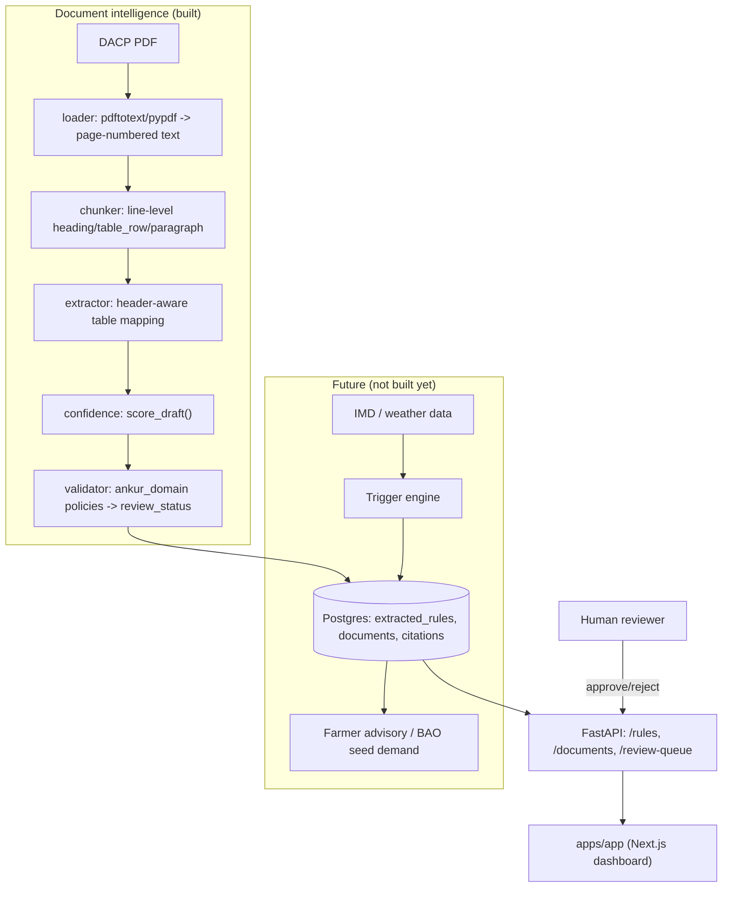

# Architecture

Full-system diagram (built pipeline, serving layer, invariants, and the deferred weather/advisory path): [`architecture.excalidraw`](./architecture.excalidraw). Open it in [Excalidraw](https://excalidraw.com) or the VS Code / Cursor Excalidraw extension.

## Data flow (built)



## Layering

```text
apps/api            <- thin FastAPI routes; imports ankur_domain + document_intelligence
apps/app             <- Next.js dashboard; talks to apps/api over HTTP only
services/document-intelligence  <- pure extraction pipeline; imports ankur_domain + ankur_schemas
services/trigger-engine         <- weather -> moisture -> condition; imports ankur_domain + ankur_schemas
packages/domain      <- ankur_domain: policies (pure functions), repository Protocols, services
packages/schemas     <- ankur_schemas: Pydantic models; zero business logic, zero I/O
```

`document_intelligence` and `trigger_engine` are siblings and never import each other. That is
the structural expression of the product rule: the extractor never sees weather, and the
trigger engine never creates a rule. They meet only through the database, and only via
`ankur_domain.policies.is_advisory_eligible` -- the trigger engine reads approved rules and
nothing else.

Dependency direction is one-way: `apps/api` and `document_intelligence` depend on `ankur_domain`,
which depends on `ankur_schemas`. `ankur_schemas` depends on nothing internal. Nothing in
`packages/` imports from `apps/` or `services/` — that would invert the dependency graph.

`document_intelligence` never imports `asyncpg`/Postgres code; persistence is wired in
`apps/api/app/ingestion.py` (`IngestionService`), which is why the extraction pipeline can run
and be tested (`tests/integration/test_ingestion.py`) with zero database dependency.

## Why these specific technology choices

- **uv workspace, not separate repos/venvs.** One lockfile, one venv, editable cross-package
  imports (`ankur_schemas`, `ankur_domain`, `document_intelligence` all import directly, no
  publishing step). See `pyproject.toml` `[tool.uv.workspace]`.
- **Raw SQL via `asyncpg`, not an ORM.** The schema is small (`db/migrations/0001_init.sql`) and
  `apps/api/app/db.py` is meant to be read top to bottom. An ORM would add indirection this
  project doesn't need yet -- see "Avoid" list in the original bootstrap brief (no premature
  abstractions).
- **`pdftotext` (poppler) over `pypdf` for text extraction, with `pypdf` as fallback.** Verified
  fact, not a style preference: `pypdf`'s text layer decoder mangles
  `data/raw/HAR16-Sirsa-30-06-2011.pdf`'s embedded font encoding (spurious `H` characters
  inserted in place of spaces/ligatures). `pdftotext -layout` decodes the same document
  correctly and preserves the column alignment DACP contingency tables depend on. See
  `services/document-intelligence/src/document_intelligence/loader.py` docstring.
- **In-memory repositories (`ankur_domain.memory`) for tests, Postgres for prod.** Both satisfy
  the same `Protocol`s in `ankur_domain.repositories` structurally -- no test-only mocking
  framework, no live database required to run `make test`.
